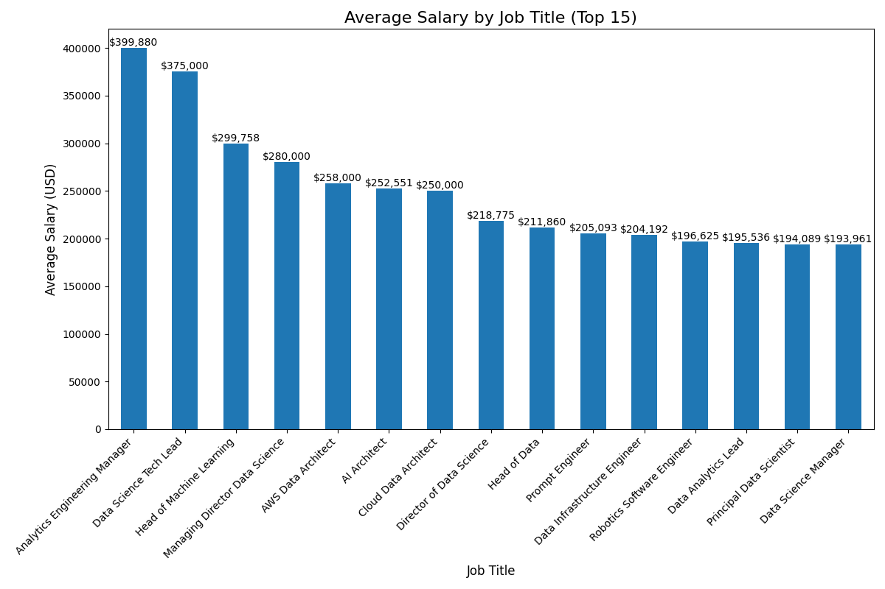

# Data Analysis Results

## Statistical Analysis

```
          work_year  salary_in_usd  remote_ratio
count  16534.000000   16534.000000  16534.000000
mean    2023.226866  149686.777973     32.003750
std        0.713558   68505.293156     46.245158
min     2020.000000   15000.000000      0.000000
25%     2023.000000  101125.000000      0.000000
50%     2023.000000  141300.000000      0.000000
75%     2024.000000  185900.000000    100.000000
max     2024.000000  800000.000000    100.000000

Top 20 Job Titles Distribution:
job_title
Data Engineer                     3464
Data Scientist                    3314
Data Analyst                      2440
Machine Learning Engineer         1705
Research Scientist                 531
Applied Scientist                  435
Data Architect                     435
Analytics Engineer                 431
Research Engineer                  306
Data Science                       271
Business Intelligence Engineer     248
Data Manager                       212
ML Engineer                        200
Business Intelligence Analyst      191
Machine Learning Scientist         138
Research Analyst                   123
Data Science Manager               122
AI Engineer                        120
Business Intelligence               98
BI Developer                        90
Name: count, dtype: int64

Experience Level Distribution:
experience_level
SE    10670
MI     4038
EN     1325
EX      501
Name: count, dtype: int64

Salary Statistics by Experience Level:
                 salary_in_usd                                        
                         count           mean    median    min     max
experience_level                                                      
EN                        1325   92327.413585   83000.0  15000  774000
EX                         501  195264.281437  192000.0  15000  465000
MI                        4038  125923.131253  115000.0  15000  800000
SE                       10670  163662.826148  155000.0  15809  750000
```





